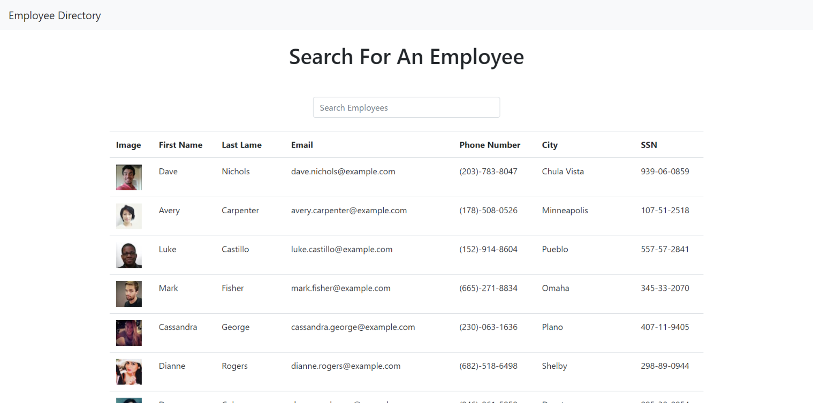

# Employee Directory

This app allows the user to view, search, and sort an employee directory. All employee information is generated through [Random User Generator](https://randomuser.me/).

The app uses React component to organize rendering.

Video Demo: https://youtu.be/Nr1SjwCwMGs

Github Repository: https://github.com/Valborg1/19-employee-directory/tree/master

Live Site: https://valborg1.github.io/19-employee-directory/
